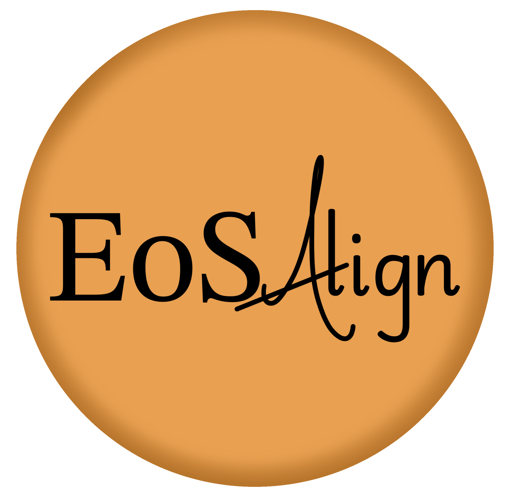

# 

   

EoSAlign is a desktop application designed for comparing and converting pressure calibrations using equations of state (EoS). This application enables the comparison of measured data directly with published calibrations of similar composition and methodology. This application supports both measured data and pressure converted data.

## Work Flow

  

EoSAlign supports two main paths:

**Path 1 — Pressure Calculation:** Enter measured data (wavelength, relative wavenumbers, or volume), select composition, and calculate pressure directly from a chosen equation of state. Ambient reference values can be adjusted, and optional error propagation is available.

**Path 2 — Pressure Alignment:** Enter data already in pressure units, select composition and method, and choose a pressure calibrant. The workflow then branches into:
- **Path 2b:** Align pressures using a study with the same composition and method, then calculate from the selected EoS.
- **Path 2c:** Align pressures through a study with a different composition and method, selecting the target composition, method, and a conversion study before calculating from the selected EoS.

**Settings:**
- General
  - Select between light mode, dark mode, and system default
- Plots
  - Select the plot theme
  - Set the font size for plot titles, labels, and ticks
  - Set the marker and line color for each study
  - Reset plots to the default settings

## Example Data File

Data files must consist of numerical values representing either pressure or measured values. Files can be formatted as either a single value per line or a single line with values separated by commas, spaces, or tabs.

If error propagation is enabled, the uncertainty data file must contain the same number of values in the same order data input, each uncertainty value corresponds directly to the data point at the same position.

<table>
  <tr>
    <td align="center"><strong>Single Column</strong></td>
    <td align="center"><strong>Single Line - Comma Separated</strong></td>
    <td align="center"><strong>Single Line - Space Separated</strong></td>
    <td align="center"><strong>Single Line - Tab Separated</strong></td>
  </tr>
  <tr>
    <td align="center">1</td>
    <td align="center">1, 2, 3, 4, 5</td>
    <td align="center">1 2 3 4 5</td>
    <td align="center">1  2  3  4  5</td>
  </tr>
  <tr>
    <td align="center">2</td>
    <td align="center"></td>
    <td align="center"></td>
    <td align="center">1\t2\t3\t4\t5</td>
  </tr>
  <tr>
    <td align="center">3</td>
    <td align="center"></td>
    <td align="center"></td>
    <td align="center"></td>
  </tr>
  <tr>
    <td align="center">4</td>
    <td align="center"></td>
    <td align="center"></td>
    <td align="center"></td>
  </tr>
  <tr>
    <td align="center">5</td>
    <td align="center"></td>
    <td align="center"></td>
    <td align="center"></td>
  </tr>
</table>

## Included Calibrations from the Literature

EoSAlign ships with over 400 calibrations spanning 32 compositions and three measurement methods (XRD, Raman, Luminescence). Calibrations are organized by composition and measurement method within the application. The superscript notation (e.g., `^2`) indicates the number of individual calibrations from that study.

| Composition | Method(s) | Studies |
|---|---|---|
| Ag | XRD | Akahama et al., 2004^2; Carter et al., 1971; Dewaele et al., 2008^2; Dorogokupets and Oganov 2003; Dorogokupets and Oganov 2007; Holzapfel et al., 2001; Holzapfel 2010; O'Bannon et al., 2021^4; Sokolova et al., 2013^2 |
| Al | XRD | Akahama et al., 2006^3; Carter et al., 1971; Chijioke et al., 2005; Dewaele et al., 2004^2; Dewaele et al., 2018^2; Dorogokupets and Oganov 2005; Dorogokupets and Oganov 2007; Greene et al., 1994; Holzapfel 2005; Sokolova et al., 2013^2 |
| Al₂O₃ | XRD, Luminescence | Aleksandrov et al., 1987; Barnett et al., 1973; Bell et al., 1986; Chijioke et al., 2005; Dewaele and Torrent, 2013; Dewaele et al., 2004; Dewaele et al., 2008; Dorogokupets and Oganov 2003; Dorogokupets and Oganov 2005; Dorogokupets and Oganov 2007; Dubrovinsky et al., 1998; Holzapfel 2003; Holzapfel 2005; Holzapfel 2010; Jacobsen et al., 2008; Jephcoat et al., 1988; Kraus et al., 2016; Lei et al., 2013 (P1); Lei et al., 2013 (P2); Mao et al., 1978; Mao et al., 1986; Oganov and Ono 2005; Piermarini et al., 1975; Richet et al., 1988; Shen et al., 2020; Shi et al., 2022; Sokolova et al., 2013; Wei et al., 2024^2; Ye et al., 2018; Zha et al., 2000 |
| Ar | XRD | Dewaele et al., 2018^2; Dewaele et al., 2021; Finger et al., 1981; Ross et al., 1986 |
| Au | XRD | Akahama et al., 2002^2; Anderson et al., 1989; Dewaele et al., 2004^2; Dewaele et al., 2018^2; Dorfman et al., 2012^2; Dorogokupets and Dewaele 2007; Dorogokupets and Oganov 2005; Dorogokupets and Oganov 2007; Fei et al., 2004; Fei et al., 2007^2; Fratanduono et al., 2021; Heinz and Jeanloz 1984; Hirose et al., 2008; Holzapfel et al., 2001; Holzapfel 2005; Holzapfel 2010; Jamieson et al., 1982; Sakai et al., 2025; Shen and Smith 2026; Shim et al., 2002; Sokolova et al., 2013^2; Takemura 2007; Takemura and Dewaele 2008^2; Tsuchiya 2003; Wang et al., 2002; Ye et al., 2017^2; Yokoo et al., 2009; Zurkowski et al., 2024^4 |
| Be | XRD, Raman | Evans et al., 2005^2; Lazicki et al., 2012^2; Nakano et al., 2002; Olijnyk and Jephcoat 2000; Velisavljevic et al., 2002^2 |
| Bi | XRD | Akahama et al., 2002^2; Campbell et al., 2023; Campbell et al., 2023b; Liu et al., 2013^3 |
| cBN | XRD, Raman | Datchi and Canny 2004 (M1); Datchi and Canny 2004 (M2); Datchi and Canny 2004 (ambient); Datchi et al., 2007^4; Goncharov et al., 2005; Goncharov et al., 2007^2; Knittle et al., 1989; Ono et al., 2015; Ren et al., 2023 |
| Co-hcp | XRD | Antonangeli et al., 2008; Dewaele et al., 2008^2; Fujihisa and Takemura 1996; Torchio et al., 2016; Yoo et al., 2000 |
| Cu | XRD | Carter et al., 1971; Chijioke et al., 2005; Dewaele et al., 2004^2; Dorogokupets and Oganov 2003; Dorogokupets and Oganov 2005; Dorogokupets and Oganov 2007; Fratanduono et al., 2020; Holzapfel et al., 2001; Holzapfel 2005; Holzapfel 2010; Ko et al., 2021; Kraus et al., 2016; Sakai et al., 2025; Sokolova et al., 2013^2; Velisavljevic et al., 2002; Wang et al., 2002 |
| Diamond | XRD, Raman | Akahama and Kawamura 2004; Akahama and Kawamura 2006; Akahama and Kawamura 2010; Aleksandrov et al., 1987; Dewaele et al., 2008; Dorogokupets and Oganov 2007; Eremets et al., 2023; Holzapfel 2005; Occelli et al., 2003; Sakai et al., 2025; Sokolova et al., 2013^2; Sun et al., 2005 |
| Fe-bcc | XRD | Dewaele et al., 2008^2; Shen and Smith 2026 |
| Fe-hcp | XRD | Dewaele et al., 2006^2; Dubrovinsky et al., 1998; Fei et al., 2016; Hirao et al., 2022; Mao and Bell 1979; Sakai et al., 2014^10; Sakai et al., 2025; Shen and Smith 2026; Smith et al., 2018; Yamazaki et al., 2012^2 |
| He | XRD | Loubeyre et al., 1993; Mao et al., 1988 |
| KCl-B2 | XRD | Campbell and Heinz, 1991; Chidester et al., 2021^2; Dewaele et al., 2012; Walker et al., 2002; Yagi 1978 |
| MgO | XRD | Carter et al., 1971; Dewaele et al., 2000; Dorogokupets and Dewaele 2007; Dorogokupets and Oganov 2007; Duffy et al., 1995; Fei et al., 2004; Fiquet et al., 1996^2; Jacobsen et al., 2008^2; Jamieson et al., 1982; Luo et al., 2023; Mao and Bell 1979; Sakai et al., 2016^2; Sakai et al., 2025; Shen and Smith 2026; Sokolova et al., 2013^2; Speziale et al., 2001^2; Tange et al., 2009^2; Ye et al., 2017^2; Zha et al., 2000 |
| Mo | XRD | Akahama et al., 2014; Carter et al., 1971; Dewaele et al., 2008^2; Dorfman et al., 2012^2; Haung et al., 2016; Hixson and Fritz 1992; Litasov et al., 2013; Sakai et al., 2025; Shen and Smith 2026; Sokolova et al., 2013^2; Wang et al., 2002; Zurkowski et al., 2024^2 |
| NaCl-B1 | XRD | Brown 1999; Decker 1971; Dewaele 2019^2; Dorogokupets and Dewaele 2007; Matsui et al., 2012; Shen and Smith 2026; Wang et al., 2024^4 |
| NaCl-B2 | XRD | Dewaele 2019^2; Dorfman et al., 2012^2; Dorogokupets and Dewaele 2007; Fei et al., 2007^2; Murakami and Takata 2019; Ono et al., 2006^4; Ono 2010; Sakai et al., 2011^8; Sakai et al., 2025; Sata et al., 2002^4; Shen and Smith 2026; Ye et al., 2018 |
| Nb | XRD | Sokolova et al., 2013^2 |
| Ne | XRD | Dewaele et al., 2008^2; Dorfman et al., 2012^2; Fei et al., 2007^2; Finger et al., 1981; Hemley et al., 1989; Ye et al., 2018^2 |
| Ni | XRD | Campbell et al., 2009; Dewaele et al., 2008^2; Hirao et al., 2022; Pigott et al., 2015 |
| Pd | XRD | Baty et al., 2024; Carter et al., 1971; Fedotenko et al., 2020^2; Frost et al., 2023^2; Guigue et al., 2020 |
| Pt | XRD | Dewaele et al., 2004^2; Dorfman et al., 2012^2; Dorogokupets and Dewaele 2007; Dorogokupets and Oganov 2005; Dorogokupets and Oganov 2007; Fei et al., 2004; Fei et al., 2007^2; Fratanduono et al., 2021; Holmes et al., 1989; Holzapfel 2005; Jamieson et al., 1982; Matsui et al., 2009; Sakai et al., 2025; Shen and Smith 2026; Sokolova et al., 2013^2; Wang et al., 2002; Ye et al., 2017^2; Yokoo et al., 2009; Zha et al., 2008 |
| Re | XRD | Anzellini et al., 2014; Dubrovinsky et al., 2012^2; Jeanloz et al., 1991; Liu et al., 1970; Olijnyk et al., 2001; Pease et al., 2025^4; Sakai et al., 2018; Sakai et al., 2025; Vohra et al., 1987; Zha et al., 2004; Zurkowski et al., 2024^2 |
| SrB₄O₇ | Luminescence | Datchi et al., 1997; Jing et al., 2013^2; Leger et al., 1990; Rashchenko et al., 2015^2; Romanenko et al., 2018; Wei et al., 2024 |
| Ta | XRD | Burrage et al., 2019^2; Chijioke et al., 2005; Cynn and Yoo 1999; Dewaele et al., 2004^4; Dorogokupets and Oganov 2005; Dorogokupets and Oganov 2007; Gorman et al., 2023; Hanfland and Syassen 2002; Holzapfel 2005; Ling-Yun et al., 2010^2; Shen and Smith 2026; Sokolova et al., 2013^2; Wang et al., 2002 |
| W | XRD | Chijioke et al., 2005; Dewaele et al., 2004^2; Ding et al., 2025; Dorogokupets and Oganov 2005; Dorogokupets and Oganov 2007; Hixson and Fritz 1992; Holzapfel 2005; Litasov et al., 2013; Mashimo et al., 2016^4; Sakai et al., 2025; Shen and Smith 2026; Sokolova et al., 2013^2 |
| YAG | Luminescence | Trots et al., 2013 |
| YAG-Y1 | Luminescence | Trots et al., 2013; Wei et al., 2024 |
| YAG-Y2 | Luminescence | Trots et al., 2013; Wei et al., 2024 |
| Zn | XRD | Dewaele et al., 2008^2; Errandonea et al., 2018; Olijnyk et al., 2000; Schulte and Holzapfel 1996 |

## Authors
Allison Pease1, Heidi N. Krauss2, Kassandra Amezcua1, Sang-Heon Shim1  

&nbsp;&nbsp;&nbsp;&nbsp;1School of Earth and Space Exploration, Arizona State University, Tempe, Arizona, United States  
&nbsp;&nbsp;&nbsp;&nbsp;2Department of Earth and Environmental Sciences, Michigan State University, East Lansing, Michigan, United States  

## Contact
For questions regarding this software, contact:  
&nbsp;&nbsp;&nbsp;&nbsp;Allison Pease: <a href="mailto:apease13@asu.edu">apease13@asu.edu</a>  
&nbsp;&nbsp;&nbsp;&nbsp;Heidi N. Krauss: <a href="mailto:Heidi.N.Krauss@gmail.com">Heidi.N.Krauss@gmail.com</a>

## Citation
If you use EoSAlign in your work, please cite it as:

Pease, A., Krauss, H. N., Amezcua, K., & Shim, S.-H. (2026). EoSAlign: An Open–Source Software for Calculating, Comparing, and Aligning Pressure Under Extreme Conditions (v1.0.0) [Software]. Zenodo. https://doi.org/10.5281/zenodo.21230860

See [CITATION.cff](CITATION.cff) for structured citation metadata.

## License &nbsp;
This project is licensed under the GNU General Public License v3.0. See the LICENSE file for details.  

##
Copyright &copy; 2026 Pease et al.

Last Updated: May 17th, 2026
